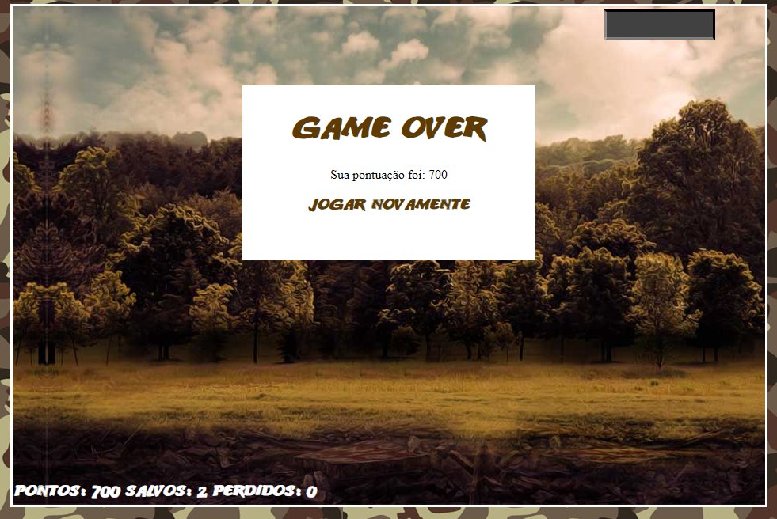

# Jogo no estilo Shoot'em up 2D desenvolvido no bootcamp Javascript Game Developer na plataforma Digital Innovation One

## O projeto foi feito utilizando _HTML_, _CSS_, _Javascript_, _jQuery_ e a extensão _jQuery Collision_

A movimentação do helicóptero é feita com as setas direcionais _cima e baixo_ e o disparo é feito com a tecla _espaço_.

A movimentação dos elementos na tela é feita modificando as propriedades CSS _top_ e _left_.

Aa animação dos personagens é feita com _CSS_ usando _animation_.

As colisões são calculadas utilizando a extensão _jQuery Collision_.

### Screenshot

